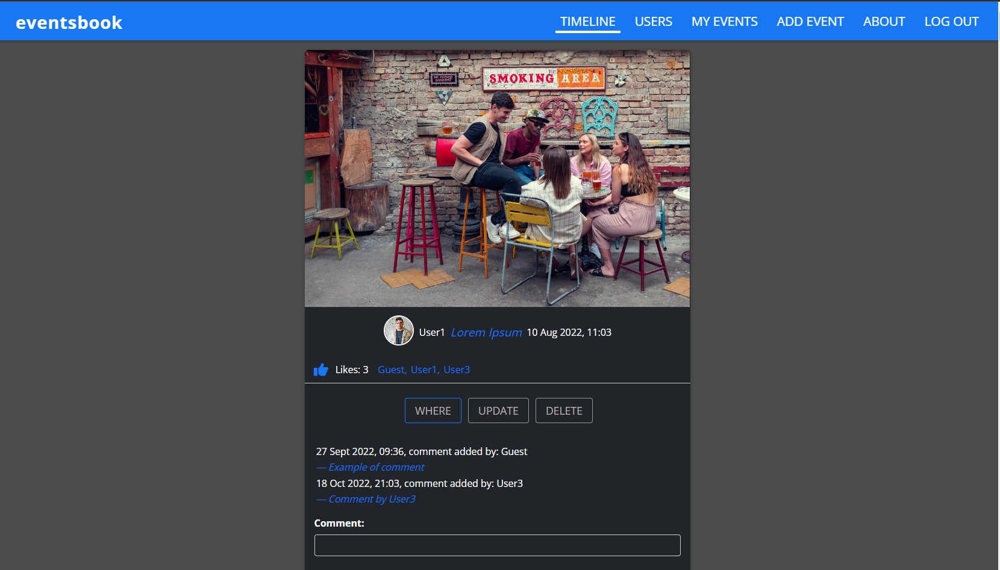

<!-- PROJECT LOGO -->
 

  

    'eventsbook' is a full stack app - this repository contains its backend source code while
    the frontend source code is stored in 
    <a href="https://github.com/spatulatom/frontend-eventsbook">
    another GitHub repository  here »</a>
     
     
    <a href="https://eventsbook-91260.web.app/allevents"><strong>View the deployed app »</strong></a>
     
     
   
  

<!-- TABLE OF CONTENTS -->

  
Table of Contents

  <ol>
    <li><a href="#about-the-project">About The Project</a></li>
    <li><a href="#built-with">Built With</a></li>
    <li><a href="#acknowledgments">Acknowledgments</a></li>
  </ol>

<!-- ABOUT THE PROJECT -->
## About The Project

1. This app is a social media platform where users can:
* log in/create an account,
* upload photos/create posts (about upcoming social events),
* add likes,
* add comments,
* tag their event's location on the Google map ,
* change their passwords.

(<a href="#readme-top">back to top</a>)

### Built With

* HTML, CSS
* [![React][React.js]][React-url]
* Node.js, Express.js, Mongoose 
* MongoBD for a database
* Amazon Web Services API for stroing photos
* Google Maps Platform API for events locations
* SendGrid API for password change
* Multer middleware library for uploading photos
* bcrypt library for hashing passwords
* jsonwebtoken for creating login token
* Firebase for deploying the frontend
* Heroku for deploying the backend

This is the backend source code of a MERN app called 'eventsbook' intended as social media platform, deployed on Heroku.
This backend server is built with Node.js, Express.js, Mongoose Schemas for 'elegant MongoDB object modelling' and MongoDB for a database. It is using Google Map Platform APIs for the 'location' functionality, Amazon AWS services API for permanently storing uploaded photos, SendGrid APIs for a notification email sent to a user upon successfull account creation/changing password. All API keys are stored in enviromental variables.

(<a href="#readme-top">back to top</a>)

<!-- ACKNOWLEDGMENTS -->
## Acknowledgments

* this project was completed at the end of the Udemy course <a href="https://www.udemy.com/course/react-nodejs-express-mongodb-the-mern-fullstack-guide/learn/lecture/16833284?start=15#overview">The MERN Guide</a>

* all users' accounts and all events have been created with the usage of free-to-use photos from www.pexels.com

(<a href="#readme-top">back to top</a>)

<!-- MARKDOWN LINKS & IMAGES -->

[linkedin-shield]: https://img.shields.io/badge/-LinkedIn-black.svg?style=for-the-badge&logo=linkedin&colorB=555
[linkedin-url]: https://www.linkedin.com/in/tomasz-s-069249244/
[product-screenshot]: images/screenshot.png
[Next.js]: https://img.shields.io/badge/next.js-000000?style=for-the-badge&logo=nextdotjs&logoColor=white
[Next-url]: https://nextjs.org/
[React.js]: https://img.shields.io/badge/React-20232A?style=for-the-badge&logo=react&logoColor=61DAFB
[React-url]: https://reactjs.org/
[Vue.js]: https://img.shields.io/badge/Vue.js-35495E?style=for-the-badge&logo=vuedotjs&logoColor=4FC08D
[Vue-url]: https://vuejs.org/
[Angular.io]: https://img.shields.io/badge/Angular-DD0031?style=for-the-badge&logo=angular&logoColor=white
[Angular-url]: https://angular.io/
[Svelte.dev]: https://img.shields.io/badge/Svelte-4A4A55?style=for-the-badge&logo=svelte&logoColor=FF3E00
[Svelte-url]: https://svelte.dev/
[Laravel.com]: https://img.shields.io/badge/Laravel-FF2D20?style=for-the-badge&logo=laravel&logoColor=white
[Laravel-url]: https://laravel.com
[Bootstrap.com]: https://img.shields.io/badge/Bootstrap-563D7C?style=for-the-badge&logo=bootstrap&logoColor=white
[Bootstrap-url]: https://getbootstrap.com
[JQuery.com]: https://img.shields.io/badge/jQuery-0769AD?style=for-the-badge&logo=jquery&logoColor=white
[JQuery-url]: https://jquery.com 
